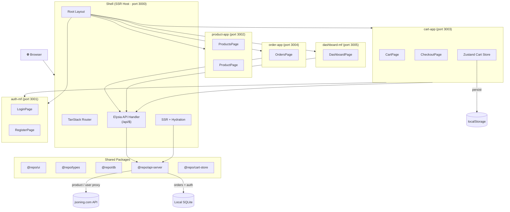

# Micro-Frontend E-Commerce Platform

A micro-frontend e-commerce platform built with TanStack Start, Module Federation (runtime), and Turborepo. Five independently built MFEs compose into a single SSR-hosted application.

## System Architecture



**Pattern**: [Runtime Federation](docs/architecture.md#runtime-federation-flow) — Shell loads MFE components via `@module-federation/enhanced/runtime`. MFE components render client-side only.

## Quick Start

```bash
pnpm install

# Development — starts shell on :3000 + all 5 MFEs on :3001-3005
pnpm dev

# Production build + serve (via vite preview)
pnpm build
node apps/shell/start.mjs

# Type check all packages
pnpm typecheck
```

## Project Structure

```
apps/
├── shell/                  SSR host (port 3000)
├── auth-mf/                Auth domain (login, register)
├── product-app/            Product domain (catalog, detail)
├── cart-app/               Cart domain (cart, checkout)
├── order-app/              Order domain (order history)
└── dashboard-mf/           Dashboard domain (analytics)
packages/
├── ui/                     Shared UI components (ShadCN-style)
├── db/                     Drizzle ORM + libSQL (SQLite)
├── api-server/             Elysia API server
├── cart-store/             Shared Zustand cart store
├── types/                  Shared TypeScript interfaces
├── env/                    T3 Env schemas
├── query/                  Shared TanStack Query client
└── utils/                  Shared utilities
```

## Documentation

| Document | Description |
|---|---|
| [Architecture](docs/architecture.md) | Diagrams, data flows, SSR lifecycle, auth flow, checkout flow — with Mermaid |
| [Domain Glossary](CONTEXT.md) | Product, Cart, User, Order, MFE, Shell — canonical definitions |
| [ADRs](docs/adr/) | Architecture Decision Records (runtime federation, TanStack Form, etc.) |

## Core Flows

| Flow | Description |
|---|---|
| [SSR Request Lifecycle](docs/architecture.md#ssr-request-lifecycle) | Browser → TanStack Router → prefetch → render → hydrate |
| [Authentication](docs/architecture.md#authentication-flow) | Email/password or social (GitHub, Google, Facebook) via Better Auth |
| [Checkout](docs/architecture.md#checkout-flow) | Cart → auth gate → shipping form → Elysia POST → Drizzle insert → confirmation |
| [Data Fetching](docs/architecture.md#data-flow-and-query-pattern) | MFE → Eden Treaty → Elysia → jsoning.com API (LRU cached) or local SQLite |
| [Cart State](docs/architecture.md#cart-state-management) | Zustand + localStorage persist, no server-side cart |
| [Dashboard Aggregation](docs/architecture.md#dashboard-aggregation-flow) | Combines jsoning.com stats + local DB orders + users |

## Tech Stack

| Concern | Choice |
|---|---|
| Monorepo | Turborepo + pnpm |
| Framework | TanStack Start (SSR) |
| Build | Vite 8 + Rolldown |
| Router | TanStack Router |
| Query | TanStack Query |
| Forms | TanStack Form |
| Auth | Better Auth |
| Database | Drizzle + libSQL (local SQLite) |
| API | Elysia (Eden Treaty client) |
| UI | Tailwind CSS v4 + ShadCN-style (Radix) |
| Federation | `@module-federation/enhanced/runtime` (runtime) |
| Client State | Zustand (localStorage) |

## Project Status

Work in progress.
