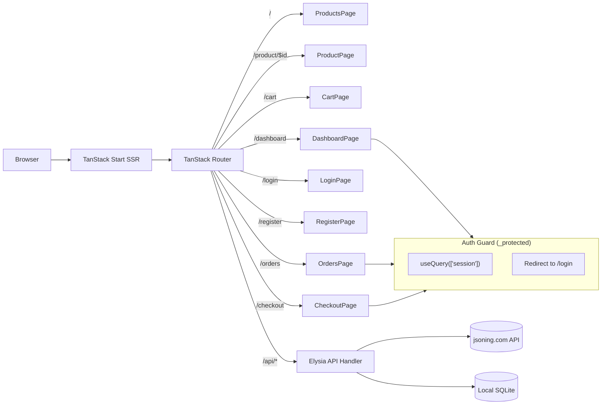

# `@repo/shell` — SSR Host

The shell is a TanStack Start application that owns SSR, routing, authentication, API proxying, layout, and hydration. It loads MFE components at runtime via `@module-federation/enhanced/runtime`.

## Architecture



## Routes

| Path | Component | Source | Auth |
|---|---|---|---|---|
| `/` | ProductsPage | `product-app` | No |
| `/product/$id` | ProductPage | `product-app` | No |
| `/cart` | CartPage | `cart-app` | No |
| `/checkout` | CheckoutPage | `cart-app` | Yes |
| `/login` | LoginPage | `auth-mf` | No |
| `/register` | RegisterPage | `auth-mf` | No |
| `/dashboard` | DashboardPage | `dashboard-mf` | Yes |
| `/orders` | OrdersPage | `order-app` | Yes |
| `/api/$` | Elysia handler | Shell | Varies |

## API

A single Elysia API server (`@repo/api-server`) runs inside `src/routes/api.$.ts`. It proxies jsoning.com API endpoints and mounts Better Auth for session management. MFE components call it via Eden Treaty.

## Dev

```bash
pnpm --filter @repo/shell dev    # Local dev on :3000
pnpm dev                          # All apps via turbo
```

## Production

```bash
pnpm build
node start.mjs                    # Runs migrations, starts preview servers on ports 3000-3005
```

## See Also

- [System Architecture](../../docs/architecture.md) — full diagrams and data flows
- [Domain Glossary](../../CONTEXT.md) — canonical definitions
