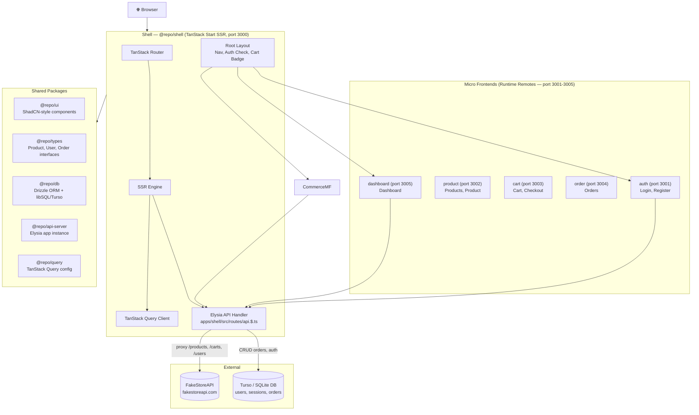
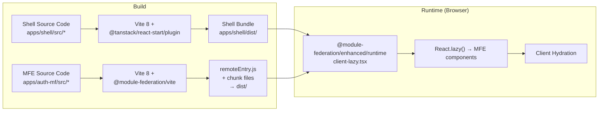
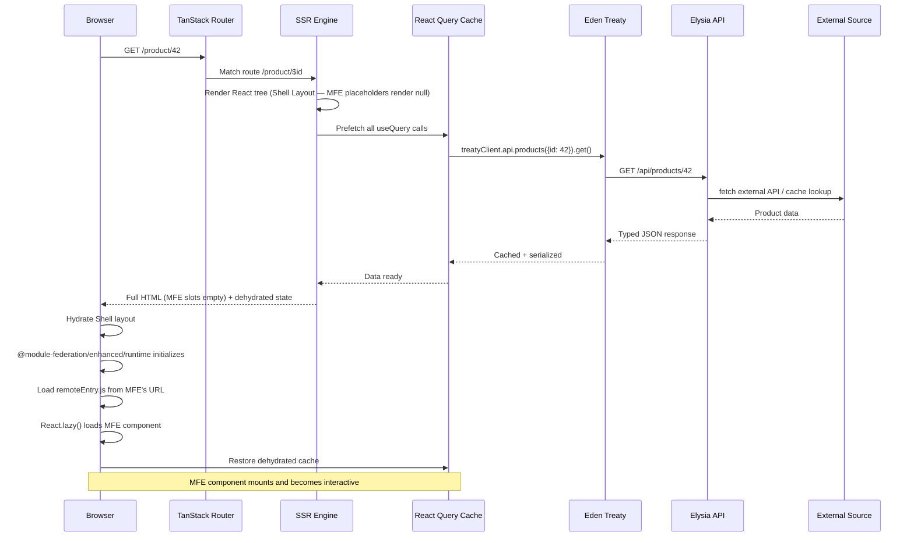
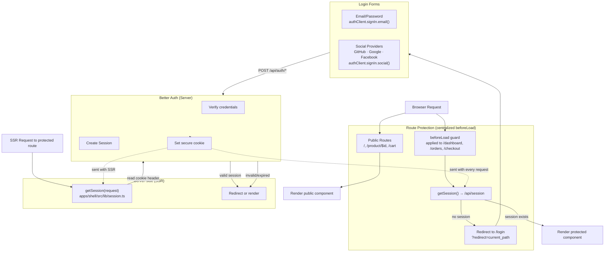
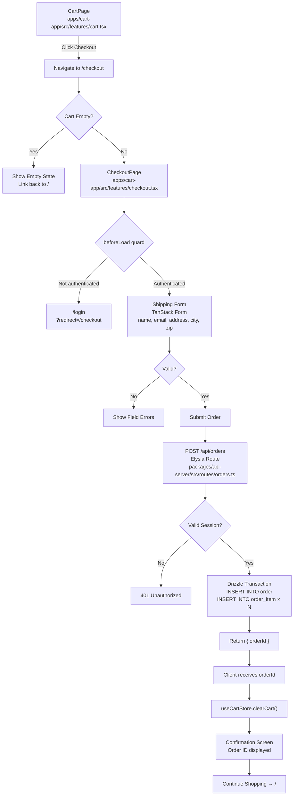
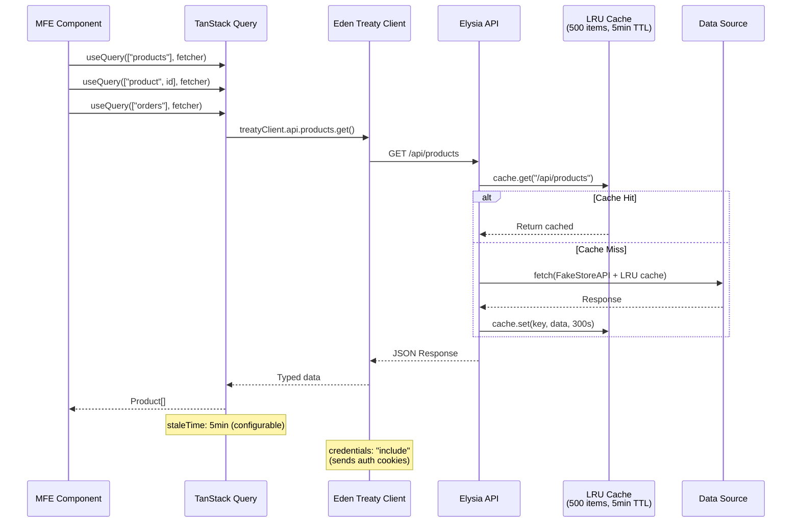
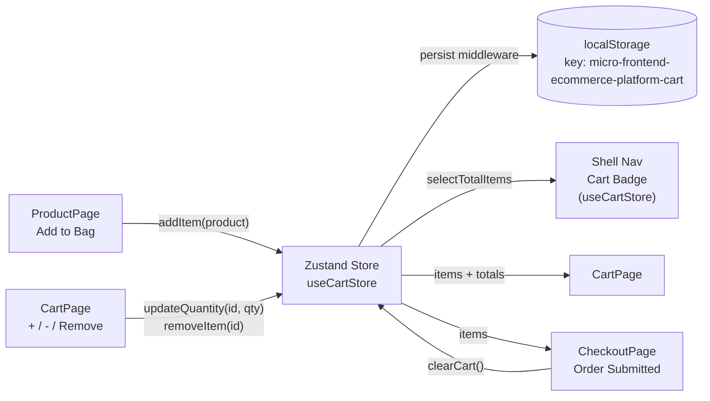
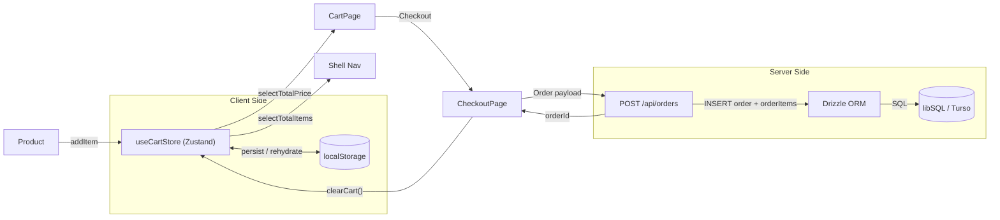
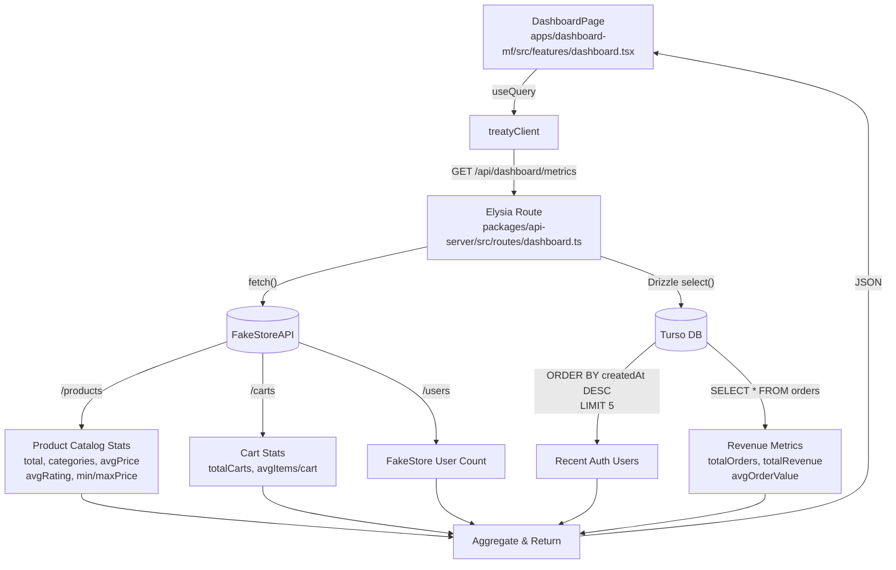

# Architecture

## System Architecture



## Runtime Federation Flow



The Shell loads MFE components at runtime via `@module-federation/enhanced/runtime`:

| MFE | Remote name | Remote URL (dev) |
|---|---|---|
| Auth | `auth` | `http://localhost:3001/remoteEntry.js` |
| Product | `product` | `http://localhost:3002/remoteEntry.js` |
| Cart | `cart` | `http://localhost:3003/remoteEntry.js` |
| Order | `order` | `http://localhost:3004/remoteEntry.js` |
| Dashboard | `dashboard` | `http://localhost:3005/remoteEntry.js` |

Remote URLs are configurable via environment variables. MFE components load client-side only — the shell renders `null` on the server and hydrates after `@module-federation/enhanced/runtime` initializes.

## SSR Request Lifecycle



### SSR Lifecycle Steps

1. **Request arrives** → TanStack Start server (Nitro) receives the request
2. **Route matching** → TanStack Router matches the URL path against the route tree
3. **Data prefetching** → The SSR engine collects all `useQuery` calls in the rendered component tree and prefetches them server-side
4. **Component rendering** → React renders the full tree: Shell Layout (nav, auth check) → page component from MFE (e.g. `ProductPage`)
5. **API calls** → MFE components call Elysia through Eden Treaty. The Elysia API runs inside the Shell's `api.$.ts` catch-all route — same process, no network hop
6. **HTML streaming** → Rendered HTML streams to the browser with a `<script>` tag containing dehydrated TanStack Query state
7. **Hydration** → React hydrates on the client. TanStack Query restores the server-fetched cache, skipping redundant re-fetches

## Authentication Flow



### Auth Implementation Details

- **Server instance**: Better Auth configured with Drizzle adapter (SQLite) in `apps/auth-mf/src/lib/auth-instance.ts`. Supports email/password + GitHub, Google, Facebook OAuth.
- **Client instance**: `createAuthClient()` in `apps/auth-mf/src/lib/auth-client.ts`. Used by LoginPage and RegisterPage.
- **Session fetch**: `getSession()` in `apps/shell/src/lib/session.ts` calls `GET /api/session` (handled by Elysia in `packages/api-server/index.ts`) and forwards the cookie from the request.
- **Route guard**: Centralized in TanStack Router `beforeLoad` on protected routes (`/dashboard`, `/orders`, `/checkout`). Uses `getSession()` and redirects to `/login?redirect=...` if unauthenticated.
- **Root layout**: `apps/shell/src/routes/__root.tsx` always fetches the session to show login/logout state and the cart badge in the nav bar.

## Checkout Flow



### Checkout Data Flow

```
CartItem[] (Zustand, localStorage)
  → JSON payload with shipping details
  → POST /api/orders (Elysia verifies session)
  → Drizzle INSERT Order + OrderItem[] (snapshot — preserves title, price, image)
  → Returns orderId (UUID v4)
  → Client clears Zustand cart → shows confirmation
```

## Data Flow and Query Pattern



### Cart State Management



The cart is **purely client-side** — Zustand with the `persist` middleware keeps it in `localStorage`. No server-side cart. On checkout, cart items are snapshot into OrderItems and the cart is cleared.

## Cart Data Flow



## Dashboard Aggregation Flow



## Technology Stack

| Concern | Technology |
|---|---|
| Monorepo | Turborepo ^2.9 + pnpm ^10.33 |
| Framework | TanStack Start (SSR, via Nitro) |
| Build | Vite ^8.0 + Rolldown |
| Router | TanStack Router (file-based, codegen) |
| Query | TanStack Query (SSR integration) |
| Forms | TanStack Form ^1.32 |
| UI | ShadCN-style (Radix UI + CVA + Tailwind v4) |
| CSS | Tailwind CSS v4 + tw-animate-css |
| Icons | Lucide React + Simple Icons |
| Auth | Better Auth ^1.6 (email/password + GitHub, Google, Facebook) |
| Database | Drizzle ORM ^0.45 + libSQL (SQLite/Turso) |
| API Server | Elysia (type-safe, Eden Treaty client) |
| Client State | Zustand ^5.13 (localStorage persist) |
| Search | FlexSearch ^0.8 (client-side full-text) |
| Caching | lru-cache ^11.3 (500 items, 5min TTL) |
| Language | TypeScript ^6.0 |
| Linting | Biome 2.4 |
| Testing | Vitest ^4.1 + Testing Library |
| Federation | @module-federation/enhanced ^2.4 (runtime) + @module-federation/vite ^1.15 (remote builds) |
| Runtime | Nitro nightly 3.0 |

## Route Map

| Path | Component | Remote | Auth Required | Guard |
|---|---|---|---|---|---|
| `/` | ProductsPage | `product/product` | No | — |
| `/product/$id` | ProductPage | `product/product` | No | — |
| `/cart` | CartPage | `cart/cart` | No | — |
| `/checkout` | CheckoutPage | `cart/cart` | Yes | `beforeLoad` |
| `/login` | LoginPage | `auth/auth` | No (redirect if authed) | — |
| `/register` | RegisterPage | `auth/auth` | No (redirect if authed) | — |
| `/dashboard` | DashboardPage | `dashboard/dashboard` | Yes | `beforeLoad` |
| `/orders` | OrdersPage | `order/order` | Yes | `beforeLoad` |
| `/api/$` | Elysia handler | Shell | Varies | — |

## Project Structure

```
Micro-Frontend-E-Commerce-Platform/
├── apps/
│   ├── shell/              # @repo/shell       SSR host (port 3000)
│   ├── auth-mf/            # @repo/auth-mf     Auth MFE (port 3001)
│   ├── product-app/        # @repo/product-app  Product MFE (port 3002)
│   ├── cart-app/           # @repo/cart-app     Cart MFE (port 3003)
│   ├── order-app/          # @repo/order-app    Order MFE (port 3004)
│   └── dashboard-mf/       # @repo/dashboard-mf Dashboard MFE (port 3005)
├── packages/
│   ├── api-server/         # @repo/api-server   Elysia API app instance
│   ├── db/                 # @repo/db           Drizzle + libSQL/Turso
│   ├── env/                # @repo/env          T3 Env + Zod schemas
│   ├── query/              # @repo/query        Shared TanStack Query client
│   ├── types/              # @repo/types        Shared TypeScript interfaces
│   ├── ui/                 # @repo/ui           ShadCN-style UI components
│   └── utils/              # @repo/utils        Shared utilities
├── docs/
│   ├── adr/                # Architecture Decision Records
│   └── architecture.md     # This file
├── CONTEXT.md              # Domain glossary
├── pnpm-workspace.yaml     # Workspace config (apps/*, packages/*)
└── turbo.json              # Turborepo task orchestration
```

## Run Commands

```bash
pnpm install              # Install dependencies
pnpm dev                  # Start all MFEs (3001-3005) + shell (3000) in parallel
pnpm dev:shell            # Start shell only (requires MFEs already running)
pnpm build                # Build all packages + MFEs + shell
pnpm typecheck            # TypeScript check all packages
pnpm test                 # Run tests
pnpm lint                 # Biome lint all packages
```
